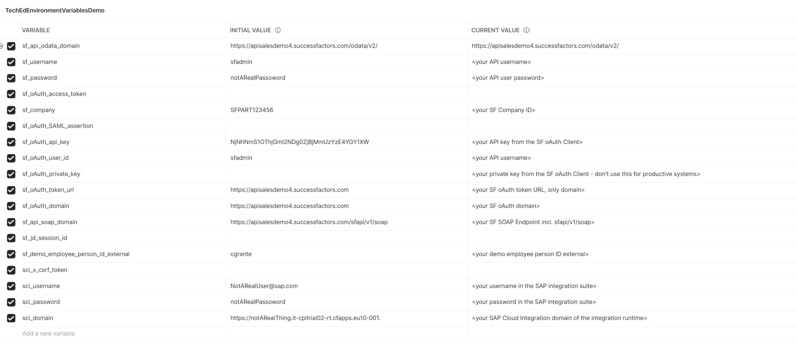

# Overview
In this folder you can find the postman collection and environment and well as the SAP SuccessFactors integration flow which demonstrates the consumption of SAP SuccessFactors SOAP and OData APIs using oAuth2 with SAML Bearer Assertion or Basic Authentication.

The following scenarios are supported in Postman in the provided collection and environment:
* Calling SAP SuccessFactors OData APIs using oAuth2 with SAML Bearer Assertion 
* Calling SAP SuccessFactors OData APIs using Basic Authentication 
* Calling SAP SuccessFactors SOAP APIs using oAuth2 with SAML Bearer Assertion
* Calling SAP SuccessFactors SOAP APIs using Basic Authentication 
* Triggering a sender based SAP Cloud Integration Flow using X-CSRF Token

The following secenarios are supported by the provided integration flow in SAP Cloud Integration Suite: 
* Calling SAP SuccessFactors SOAP and OData APIs using oAuth2 with SAML Bearer Assertion

# Configure Postman collection and environment

## Step 1
Download and install Postman v8.10.0 or later

## Step 2
Download the environment file and the collection file to your computer

## Step 3
Import the environment file and the collection into your postman

## Step 4
Provide values for all variable in the environment which are marked with entries in brackets a value for the current value:

# Run Postman collection

## Scenario 1: Calling SAP SuccessFactors OData APIs using oAuth2 with SAML Bearer Assertion

### Step 1
Call the "generate oAuth SAML assertion" request. This generates the SAML assertion using the private key and stores it in a postman variable.
### Step 2
Call the "request oAuth access token with SAML assertion" request. This used the SAML assertion the get the access token and stores it again in a variable.
### Step 3
Call either the "SOAP API Login with oAuth Access Token" and followed by the "SOAP UI Query CE API Fullmode Copy" request to get data via the access token using the SOAP API or call the "Get User with oAuth Access Token" request to get data from the User Entity using OData with the access token.

# Trigger SAP Cloud Integration Flow from Postman

### Step 1:
Upload the integration flow above into your SAP Cloud Integration environment

### Step 2: 
Follow this blog or the video above to configure the corresponding key pair and security credentials of your tenant: https://blogs.sap.com/2021/03/26/sap-cloud-integration-oauth2-saml-bearer-x.509-certificate-authentication-support-in-successfactors-connector/. Add the security credentials as shown in the video to the integration flow and deploy it.

### Step 3:
Follow this blog to configure your BTP user to allow calling the deployed CPI flow from postman
https://blogs.sap.com/2018/04/17/working-with-http-input-in-sap-cloud-platform-integration-flows-and-how-to-test-these-flows-with-postman/ 

### Step 4:
Call the "Fetch Token X-CSRF Token" in Postman followed by the "Trigger CPI Flow with X-CSRF Token" request to trigger the CPI flow.
